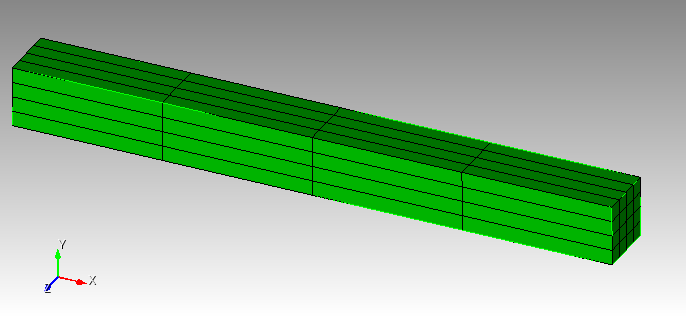

# Adding Givens BC to solids

(999 : left, 98 : right, 997 : front, 996 : back, 995 : top, 994: bottom) 

How to run:

degree 1:

`./elasticity -problem hyperFS -mesh ./meshes/test.exo -degree 1 -nu 0.3 -E 6.9e10 -bc_clamp 999,998,997,996,995,994 -bc_clamp_999_givens 1,0,0,0.174533 -bc_clamp_998_givens 1,0,0,0.174533 -bc_clamp_997_givens 1,0,0,0.174533 -bc_clamp_996_givens 1,0,0,0.174533 -bc_clamp_995_givens 1,0,0,0.174533 -bc_clamp_994_givens 1,0,0,0.174533 -num_steps 10 -snes_linesearch_type cp -snes_rtol 1e-7`

degree 2 and above divereges:

`./elasticity -problem hyperFS -mesh ./meshes/test.exo -degree 2 -nu 0.3 -E 6.9e10 -bc_clamp 999,998,997,996,995,994 -bc_clamp_999_givens 1,0,0,0.174533 -bc_clamp_998_givens 1,0,0,0.174533 -bc_clamp_997_givens 1,0,0,0.174533 -bc_clamp_996_givens 1,0,0,0.174533 -bc_clamp_995_givens 1,0,0,0.174533 -bc_clamp_994_givens 1,0,0,0.174533 -num_steps 10 -snes_linesearch_type cp -snes_rtol 1e-7`
`
